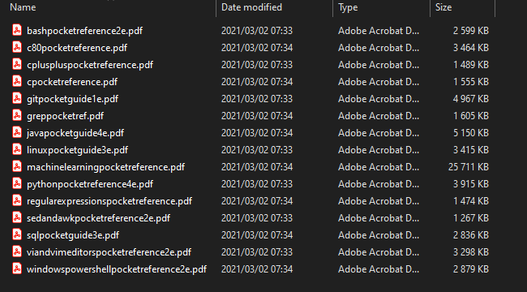

# BookFilesRename

This is a simple script, to rename the files downloaded from humble bundle.
Takes the single string names, and adds spaces using the package [wordninja](https://pypi.org/project/wordninja/).
This package was built up from this answer on stackoverflow: [how-to-split-text-without-spaces-into-list-of-words](https://stackoverflow.com/questions/8870261/how-to-split-text-without-spaces-into-list-of-words)

This can be used to rename files in any directory you specify and isn't limited to my use case, of course. If you have a folder with a bunch of files named without spaces, you can use this script.

## Usage

Change the path in the script, run the script.

## Some example output

### Before

### After

#### Disclaimer

Use at your own risk. Always read scripts carefully before running them on your machine.